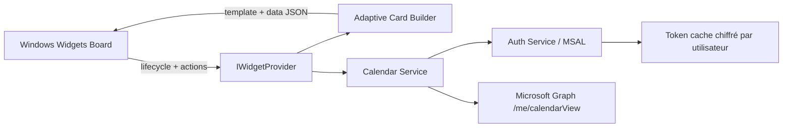

# Proposition d’architecture — OutlookNextEvent

## 1. Vue d’ensemble et objectif

OutlookNextEvent est un widget Windows 11 minimaliste qui affiche les prochains événements du calendrier Outlook de l’utilisateur dans le panneau Widgets. Le MVP vise d’abord la fiabilité : connecter un compte Microsoft, lire les prochains événements via Microsoft Graph, afficher les `N` prochains éléments dans une Adaptive Card, puis rafraîchir sans surprendre l’utilisateur. Tout ce qui n’aide pas directement à « voir mes prochaines réunions » est hors scope v1.

## 2. Stack technique confirmée / assumée

Stack proposée :

- **C# / .NET 8 LTS** pour le fournisseur de widget et la logique applicative. Simple, supporté, proche des APIs Windows. **[à vérifier]** : si l’implémentation commence après disponibilité stable de .NET 10 LTS + Windows App SDK compatible, réévaluer.
- **Windows App SDK** pour le contrat de widget tiers (`IWidgetProvider`) et l’intégration Windows 11.
  - Minimum connu : **Windows App SDK 1.2+** pour les widgets tiers packagés. Recommandation : utiliser la version stable courante au moment du développement. **[à vérifier]**
  - Minimum Windows : **Windows 11 avec support des widgets tiers**. Les premiers builds publics étaient Windows 11 Insider build 25217+; pour production, cibler Windows 11 22H2+ avec la version Widgets/Windows App SDK requise. **[à vérifier]**
- **MSIX packaged app** : requis pour l’identité applicative, l’enregistrement du provider et le packaging Windows.
- **Adaptive Cards JSON** : rendu par l’hôte Widgets; l’app fournit le template et les données.
- **Microsoft Graph** : lecture du calendrier avec `/me/calendarView` plutôt que `/me/events`, car `calendarView` expanse les récurrences dans une fenêtre bornée.
- **MSAL / Entra ID** : authentification d’une application desktop/public client avec permissions déléguées.

Décision pragmatique : ne pas ajouter de framework UI complet tant que le widget suffit. Une petite fenêtre compagnon peut exister uniquement pour connecter/reconnecter le compte si MSAL ne peut pas être piloté proprement depuis l’action du widget.

## 3. Architecture haut niveau



Composants :

- **Widget provider process** : implémente `IWidgetProvider`, reçoit les événements de cycle de vie, décide quand rafraîchir et pousse les mises à jour vers l’hôte Widgets.
- **Adaptive Card renderer/builder** : transforme un modèle `NextEventViewModel` en template + data JSON. Aucun appel réseau ici.
- **Data/service layer** : orchestre la requête calendrier, normalise fuseaux horaires, trie, filtre, limite au nombre d’événements à afficher.
- **Auth layer** : encapsule MSAL, acquisition silencieuse/interactive, cache de jetons et état de connexion.
- **Companion app minimal** : point d’entrée packagé pour sign-in, reconnect, diagnostic simple. Pas d’UI riche en v1.

## 4. Packaging et enregistrement

- Produire une **application MSIX packagée** avec identité stable : Publisher, Package Family Name, AppUserModelId, icônes et nom d’affichage.
- Le package déclare le **widget provider** dans le manifeste et inclut le manifeste spécifique aux widgets : identifiants de widget, tailles supportées, nom, description, icônes, template initial et activation provider. Le schéma exact du manifeste/namespace Windows App SDK doit être confirmé avant implémentation. **[à vérifier]**
- Garder un seul widget v1 : `NextEventsWidget`.
- L’identité MSIX doit rester stable entre versions; elle influence le cache MSAL, les associations d’activation, les paramètres utilisateur et les mises à jour.
- Distribution v1 : sideload/dev package d’abord. Microsoft Store, signature production et pipeline CI sont différés tant que le provider et l’auth ne sont pas validés.

## 5. Flux de données

1. L’hôte Widgets active ou crée le widget (`CreateWidget` / `Activate`). **[à vérifier]** : noms exacts et ordre des hooks selon la version Windows App SDK.
2. Le provider demande au `CalendarService` les prochains événements.
3. `CalendarService` demande un jeton à `AuthService`.
   - Si un jeton valide existe : `AcquireTokenSilent`.
   - Sinon : état « Connexion requise » dans la carte, avec action `Connecter Outlook`.
4. Requête Graph :
   - Endpoint : `GET /me/calendarView?startDateTime={now}&endDateTime={now+window}`.
   - Permission : `Calendars.Read`.
   - Header recommandé : `Prefer: outlook.timezone="{timezone}"`.
   - Fenêtre v1 proposée : 7 jours, puis limite locale aux prochains `N` événements.
5. Shaping :
   - exclure événements annulés;
   - trier par début ascendant;
   - gérer all-day et fuseau local;
   - produire un modèle léger : titre, heure, durée, lieu/Teams si disponible, statut de temps restant.
6. `AdaptiveCardBuilder` génère template + data JSON.
7. Le provider appelle l’API de mise à jour du widget avec la carte.

Stratégie de rafraîchissement v1 :

- Rafraîchir sur création/activation du widget.
- Rafraîchir sur action utilisateur « Actualiser ».
- Pendant que le widget est actif, viser un refresh périodique raisonnable (ex. 5–15 minutes) et arrêter sur désactivation. Les limites de fréquence/background de l’hôte Widgets doivent être validées. **[à vérifier]**
- Conserver le dernier état réussi en mémoire et afficher une erreur non bloquante si Graph échoue.

## 6. Approche d’authentification

- Entra ID : app registration **public client / desktop**.
- Scopes v1 :
  - `Calendars.Read` requis;
  - `User.Read` seulement si nécessaire pour afficher le compte connecté ou stabiliser l’expérience MSAL. Sinon éviter.
- MSAL :
  - essayer `AcquireTokenSilent` au démarrage/refresh;
  - déclencher `AcquireTokenInteractive` depuis une action de connexion/reconnexion;
  - privilégier le broker Windows/WAM si compatible avec app packagée. **[à vérifier]**
- Redirect URI :
  - utiliser la configuration desktop recommandée par MSAL (`WithDefaultRedirectUri` ou redirect URI native appropriée). Le choix exact pour MSIX + broker doit être confirmé avant enregistrement Entra. **[à vérifier]**
- Cache :
  - cache de jetons MSAL par utilisateur, protégé par Windows/DPAPI ou mécanisme MSAL Extensions;
  - ne jamais stocker mot de passe ou refresh token manuellement.
- Reconnect path :
  - action « Reconnecter »;
  - suppression/oubli du compte en cache si consentement retiré, tenant changé ou erreur `invalid_grant`;
  - retour à la carte « Connexion requise ».

## 7. Structure de dépôt proposée

```text
OutlookNextEvent\
├─ OutlookNextEvent.sln
├─ src\
│  ├─ OutlookNextEvent.App\
│  │  ├─ Package.appxmanifest
│  │  ├─ App.xaml / App.xaml.cs
│  │  ├─ Widgets\
│  │  │  └─ NextEventsWidgetProvider.cs
│  │  ├─ Cards\
│  │  │  ├─ next-events.template.json
│  │  │  └─ CardBuilder.cs
│  │  └─ Assets\
│  ├─ OutlookNextEvent.Core\
│  │  ├─ Calendar\
│  │  │  ├─ CalendarService.cs
│  │  │  └─ EventShaper.cs
│  │  ├─ Auth\
│  │  │  └─ AuthService.cs
│  │  └─ Models\
│  │     └─ NextEvent.cs
│  └─ OutlookNextEvent.Infrastructure\
│     ├─ Graph\
│     │  └─ GraphCalendarClient.cs
│     └─ Settings\
├─ tests\
│  ├─ OutlookNextEvent.Core.Tests\
│  └─ OutlookNextEvent.App.Tests\
├─ docs\
│  └─ architecture.md
└─ .squad\
```

Intentions :

- `OutlookNextEvent.App` : app packagée, provider widget, manifeste MSIX, Adaptive Cards et points d’activation.
- `OutlookNextEvent.Core` : logique métier pure : tri, filtrage, modèle d’événements, règles de présentation.
- `OutlookNextEvent.Infrastructure` : Graph, MSAL, stockage de paramètres. Isolé pour faciliter les tests.
- `tests` : tests unitaires et, plus tard, tests d’intégration ciblés.
- `docs` : décisions d’architecture lisibles par l’équipe.

## 8. MVP v1 vs plus tard

### Inclus v1

- Un widget `NextEventsWidget`.
- Connexion à un seul compte Microsoft choisi par l’utilisateur.
- Lecture Graph `/me/calendarView` avec fenêtre bornée.
- Affichage des prochains `N` événements, triés, avec heure locale.
- États Adaptive Card : non connecté, chargement, liste, vide, erreur/retry.
- Refresh sur activation et action manuelle; refresh périodique seulement si compatible avec le cycle de vie Widgets.
- Packaging MSIX dev/sideload.

### Différé

- Multi-compte et fusion de calendriers.
- Découverte automatique du compte exact utilisé par le nouveau Outlook.
- Sélection de calendriers spécifiques.
- Paramètres avancés de lookahead, heures ouvrées, événements privés.
- Actions riches : rejoindre Teams, répondre, ouvrir Outlook sur l’événement.
- Notifications/toasts.
- Offline/delta sync sophistiqué.
- Microsoft Store, signature production et pipeline complet.
- Thèmes visuels complexes et personnalisation poussée.

## 9. Questions ouvertes / risques

1. **Disponibilité réelle des widgets tiers** : version Windows 11, Windows App SDK, canal Widgets et contraintes de distribution exactes. **[à vérifier]**
2. **Schéma exact du manifeste widget/MSIX** : namespaces, fichiers requis, tailles supportées, activation provider. **[à vérifier]**
3. **Auth MSIX + MSAL** : broker WAM, redirect URI et comportement depuis une action de widget. **[à vérifier]**
4. **Compte “new Outlook”** : Graph lit le compte connecté via MSAL, mais ne garantit pas automatiquement le même compte que le nouveau Outlook si plusieurs comptes existent.
5. **Refresh/background** : l’hôte Widgets peut limiter les timers, la fréquence de mise à jour ou l’exécution hors activation.
6. **Tenant/consentement** : certains environnements professionnels peuvent bloquer `Calendars.Read` ou exiger admin consent.
7. **Fuseaux horaires/récurrences** : `calendarView` aide, mais il faut tester DST, all-day, exceptions et événements annulés.

## 10. Premières tâches suggérées après approbation

- **Naomi** : définir les états Adaptive Card v1 (`non connecté`, `liste`, `vide`, `erreur`) et les contraintes de contenu pour petits/grands formats.
- **Alex** : faire un spike MSAL + Graph `/me/calendarView` dans une app packagée minimale; confirmer redirect URI, broker WAM, scopes et consentement.
- **Amos** : préparer la stratégie de tests : shaping des événements, tri/fuseaux horaires, erreurs Graph, rendu JSON attendu, doubles/fakes pour Auth/Graph.
- **Holden** : valider le manifeste widget/MSIX minimal, figer le découpage de projets et réduire le scope avant tout scaffolding.
